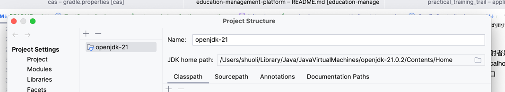

## 注意!!

一定要看readme！如果还遇到问题，不要犹豫直接找相关人士，不要浪费时间！

对于Gateway模块和common-utils模块，因为功能问题不需要继承父模块的种种依赖，所以依赖是自己定义的，再进行修改的时候请严格进行依赖对照，写出注释。

docker配置有更新，新配置了redis，对存储数据的目录有了更改。原本的data文件夹改名为mysql-data并移入一个data文件里，也就是由./data改为./data/mysql-data，新增了一个redis-data文件夹，用于存储redis的数据，也就是./data/redis-data
所以需要你将你本地的data文件夹更名为mysql-data，并再新建data文件夹，将mysql-data文件夹放入data文件夹中，然后再进行docker-compose up
如果自己另设路径的话不要忘记修改gitignore文件，不要将data文件上传了。


## 数据库和redis初始化

数据库初始话首先需要确保安装好docker，然后在根目录下执行以下命令：

```shell
docker-compose up 
```
数据库在3307本地，redis在6380本地

## nacos配置

目前的nacos的配置是，默认的网关在8080端口，ac，te，un分别是8081，8082，8083端口，nacos server在服务器上的8848端口，我的服务器的ip是8.130.106.248，可在本地的浏览器上访问然后进行修改
访问的地址是http://8.130.106.248:8848/nacos

## 网关配置
我在nacos server里已经配置了网关，如果你们写的时候想自己改也可以，现在的配置是

academic-management对应ac，映射的时候被映射者是无感的，
比如访问http://localhost:8080/ac/get
被映射到http://localhost:8081/get
其他两个的缩写是te和un，分别对应8082和8083端口

## 身份认证
身份认证目前只是再网关上进行了配置，也就是打算只这样做的，所以如果需要用到身份鉴权的话，使用postman等工具
的时候，切记要从网关的端口进行访问，当然也要对应各自微服务在网关的映射名。比如想测试academic-management的get接口，应该访问http://localhost:8080/ac/get
那么怎么拿到登录的数据呢，只需要按如下案例打上注解即可
```java
    @GetMapping("/getPrimaryInfo")
    public String getPrimaryInfo(@RequestHeader("PrimaryInfo") String primaryInfo) {
        return primaryInfo;
    }
```
这里的primaryinfo就是用户的id或者说username

再次之前还需要做一些事情。首先，要将cas server的证书导入到java中，否则不能和cas server建立连接，首先要找到自己项目运行的lib/security路径，如果使用的是
idea的java，找到idea的jre路径（我的地址示例如图，这个可从project structure里看到），然后将cas server的证书导入到这个路径下，证书文件已经在跟目录下了

找到之后运行以下命令，这里的java的lib/security路径是我的，你们要根据自己的路径进行修改，其他的不用改
```shell
keytool -import -alias cas-server-cert -keystore /Users/shuoli/Library/Java/JavaVirtualMachines/openjdk-21.0.2/Contents/Home/lib/security/cacerts -file ./cas.cer
```

之后，如果要正确的有权限的访问是需要token的，如何获得token？访问网关提供的api即可，下图是postman中如何访问的


之后访问其他网关的api就带着这个token就行了，在postman中如下图所示


目前网关也开放了一些不需要鉴权的api，你们也可以自己加入，在gateway/src/main/java/com/fjxgwzd/gateway/filter/JwtRequestFilter.java里配置，其实如果你们想不用鉴权测试api的话，之前访问各自微服务的端口
就可以了，不需要经过网关

目前的登录做的很简单，注销和一些异常处理和错误处理包括超时等都没有做，之后会完善。

### 用户插入
目前只有两个用户，账密分别是lishuo:lishuo,ru:ru，新增用户可以在数据库里插入，按照以下图示连接数据库


然后在users表里插入数据即可，密码暂时还是明文的，后续会改成加密的，然后这里的字段是username和password，username就对应了id，后续字段名应该也不会改，原因是麻烦，使用
cas 默认的用户名密码最简单，考虑到我们也只是用id和password登录，所以这里的字段名不会改，以后记住这个username字段就是用户的id，数据现在这个数据库上存储者，之后再考虑转移数据库

